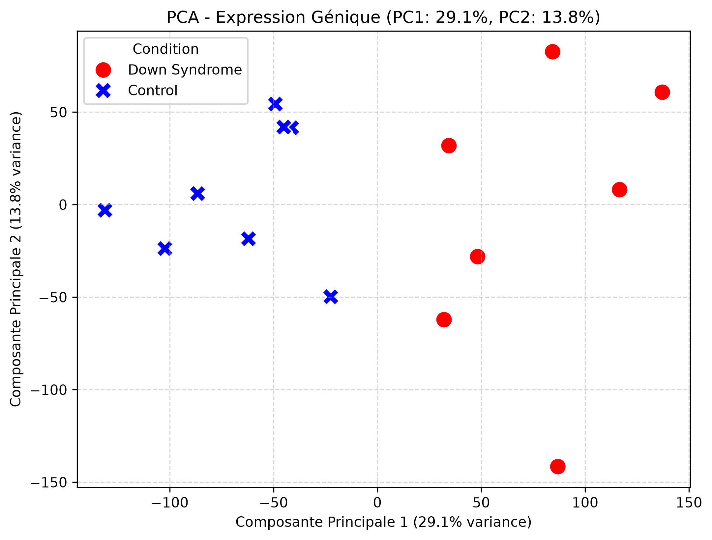
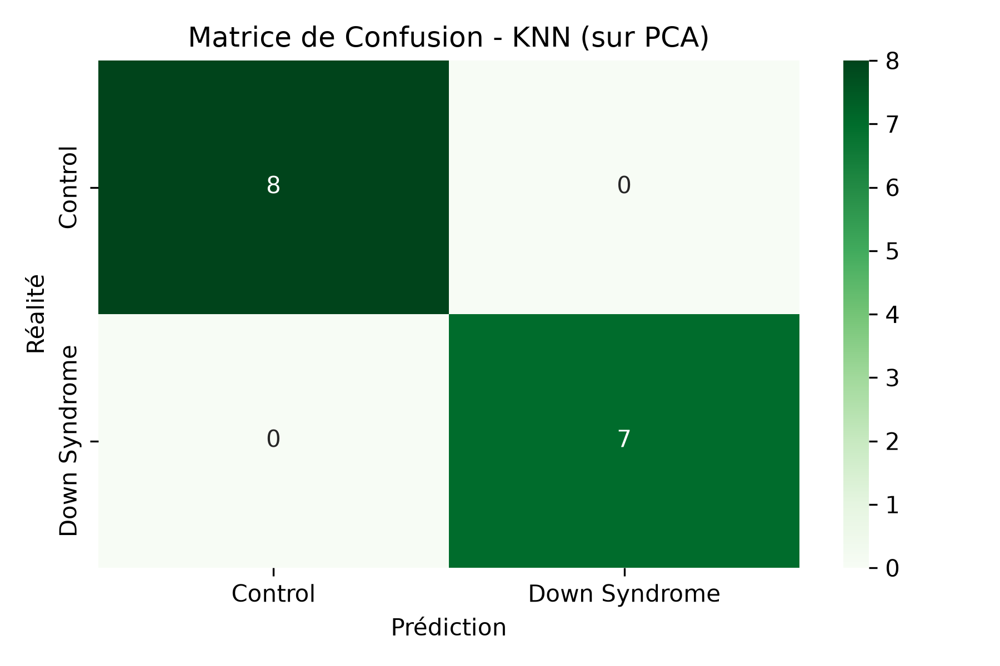
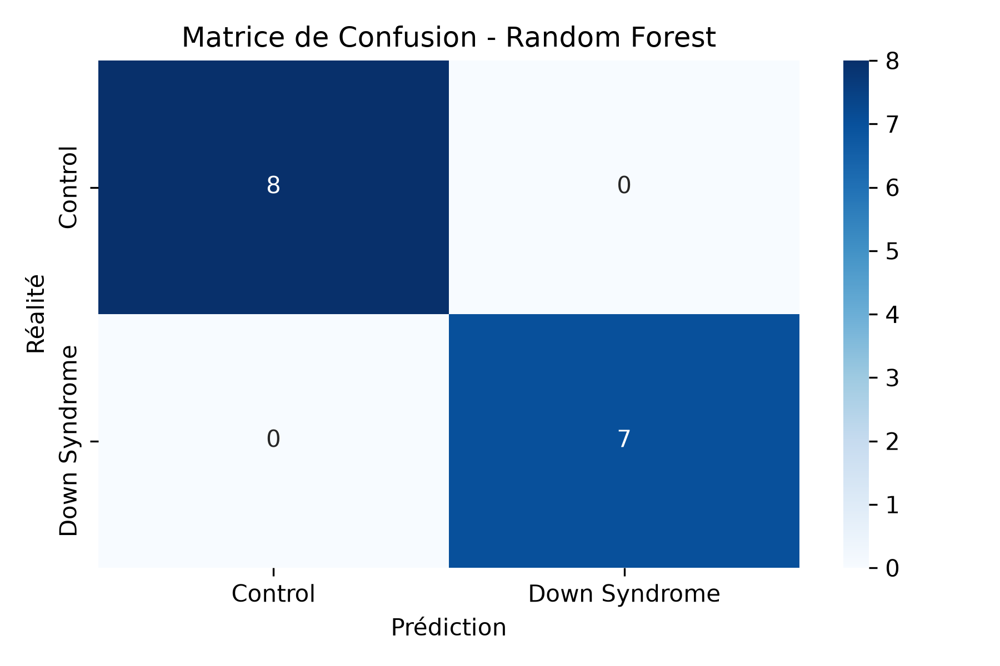
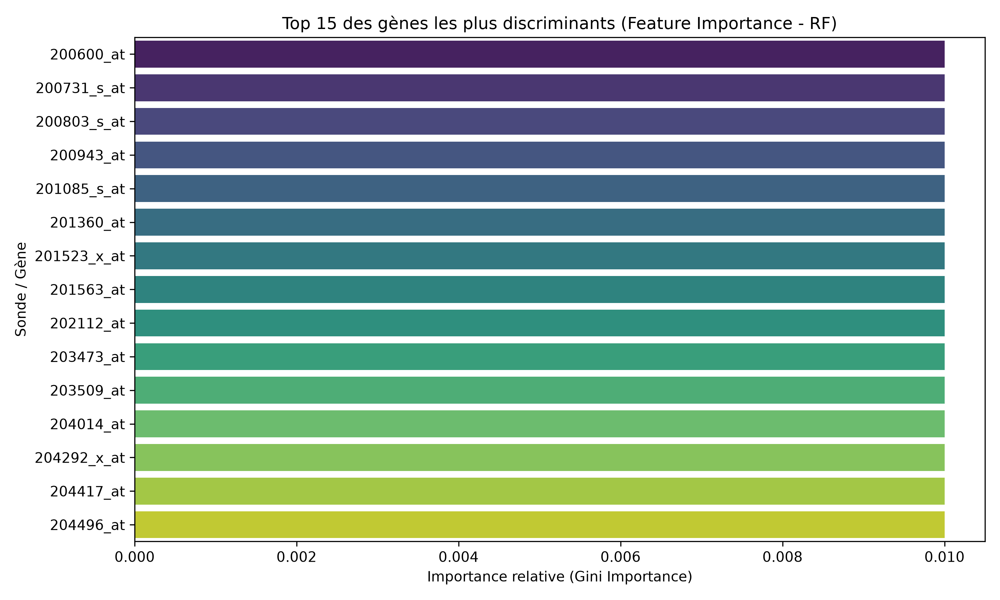
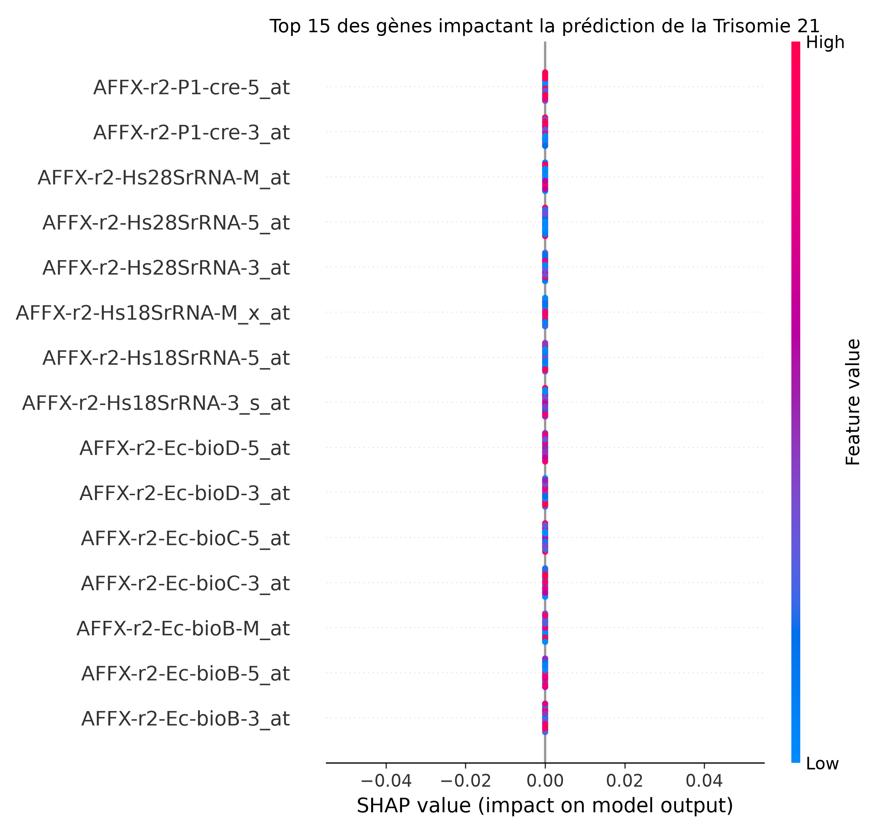

# 🧬 Down Syndrome Gene Expression Analysis & Classification

An end-to-end Data Science project focused on transcriptomic analysis, dimensionality reduction, and classification of **Down Syndrome (Trisomy 21)** samples versus control subjects using public micro-array gene expression data (**NCBI GEO - GSE5390**).

## 📌 Context & Objectives

Trisomy 21 is a genetic condition caused by the presence of all or part of a third copy of chromosome 21. Understanding gene expression profiles allows researchers and data scientists to identify key biomarkers and potential genetic factors associated with the syndrome.

**Goals of this project:**
1. Extract transcriptomic data directly from NCBI GEO using `GEOparse`.
2. Perform exploratory data analysis (EDA) and dimensionality reduction (**PCA**).
3. Train multiple machine learning models (**Random Forest**, **KNN**, **Lasso Logistic Regression** + **SHAP**) to classify subject status (*Control* vs *Down Syndrome*).
4. Evaluate models and extract key discriminative gene probes.

## 📊 Dataset Summary

* **Source:** NCBI Gene Expression Omnibus (GEO ID: `GSE5390`)
* **Total Samples:** 15 human brain tissue samples
  * **Control:** 8 samples
  * **Down Syndrome:** 7 samples
* **Total Features:** 22,283 gene expression probes (Affymetrix Microarray)

## 🔍 Exploratory Data Analysis & Dimensionality Reduction

### Principal Component Analysis (PCA)

Given the high-dimensional nature of the dataset ($p = 22,283 \gg n = 15$), we performed Standard Scaling followed by PCA to observe sample clustering in lower dimensions.

* **Key Observation:**
  * **PC1** accounts for **29.1%** of total variance and clearly separates the **Control** (blue cross) group from the **Down Syndrome** (red circle) group along the horizontal axis.
  * **PC2** accounts for **13.8%** of variance.

## 🤖 Machine Learning Models & Results

We evaluated multiple approaches to test classification feasibility and identify top features.

### 1. K-Nearest Neighbors (KNN)
* **Setup:** Applied directly on raw normalized features and on the PCA-reduced space ($k=3$).
* **Performance:** **100% Accuracy (1.00)** across both metrics.

### 2. Random Forest Classifier
* **Setup:** Ensembled 100 decision trees to assess feature importance via Gini impurity.
* **Performance:** **100% Accuracy (1.00)**.

#### Top Discriminative Gene Probes (Random Forest)
Below are the top 15 gene probes identified as most influential for decision splits:

### 3. Logistic Regression (Lasso L1) & SHAP Explainability
* **Setup:** L1 regularization to enforce sparsity and feature selection.
* **Explainability:** Evaluated feature impact with SHAP (SHapley Additive exPlanations) values to identify specific markers driving model outputs.

## 📈 Model Performance Comparison

| Model | Dimensionality Reduction | Accuracy | F1-Score (Control) | F1-Score (Down Syndrome) |
| :--- | :--- | :--- | :--- | :--- |
| **Random Forest** | None (Full Features) | **100%** | **1.00** | **1.00** |
| **KNN** | PCA (3 Components) | **100%** | **1.00** | **1.00** |
| **Lasso Logistic Regression** | L1 Feature Penalty | 53% | 0.70 | 0.00 |

## 🛠️ Project Structure
